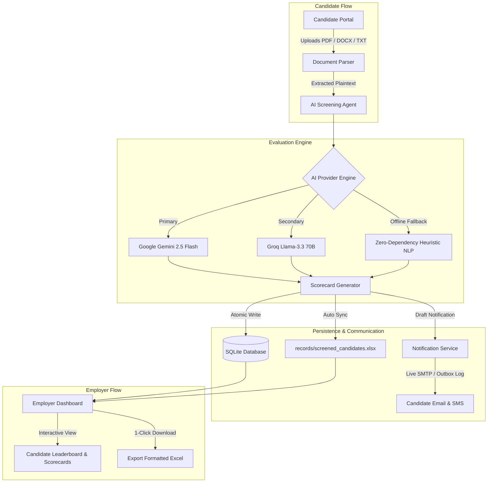

# 🎯 TalentAI • Autonomous AI Agent for Resume Screening & Hiring Automation

[](https://www.python.org/)
[](https://fastapi.tiangolo.com/)
[](https://aistudio.google.com/)
[](https://groq.com/)
[](https://openpyxl.readthedocs.io/)
[](https://opensource.org/licenses/MIT)
[]()

> **An enterprise-grade, autonomous AI resume evaluation and candidate screening platform.**  
> Features dual role-based portals for **Employers** and **Candidates**, multi-model AI evaluation (Google Gemini, Groq Llama 3.3, and offline NLP heuristic engines), real-time synchronized **Excel spreadsheet reporting**, and automated candidate **Email & SMS status notifications**.

---

## 📑 Table of Contents

- [Key Highlights](#-key-highlights)
- [System Architecture](#-system-architecture)
- [Dual Role-Based Portals](#-dual-role-based-portals)
- [AI Screening Engine & Providers](#-ai-screening-engine--providers)
- [Quick Start Guide](#-quick-start-guide)
- [Deploying on Vercel](#-deploying-on-vercel)
- [Environment Configuration](#-environment-configuration)
- [Step-by-Step Testing Walkthrough](#-step-by-step-testing-walkthrough)
- [REST API Reference](#-rest-api-reference)
- [Automated Test Suite](#-automated-test-suite)
- [Project Directory Structure](#-project-directory-structure)
- [Security & Privacy Standards](#-security--privacy-standards)
- [Contributing & License](#-contributing--license)

---

## 🌟 Key Highlights

- 🏢 **Dual Dedicated Portals**:
  - **Employer Portal**: Post job descriptions, configure mandatory vs. preferred skills, calibrate custom weighted rubrics, review real-time candidate scorecards, download synchronized Excel workbooks, and manage communication logs.
  - **Candidate Portal**: Explore available openings, review required and preferred qualifications, upload resumes (`PDF`, `DOCX`, `TXT`), submit applications, and monitor live screening status.
- 🤖 **Multi-Engine AI Scoring Pipeline**:
  - **Google Gemini API** (`gemini-2.5-flash` / `gemini-1.5-flash`) via Google AI Studio free tier.
  - **Groq Cloud API** (`llama-3.3-70b-versatile`) for ultra-low latency open-weights inference.
  - **Zero-Dependency Heuristic NLP Fallback**: Guaranteed offline functionality with rule-based scoring even without active API keys or internet access.
- 📊 **Real-Time Live Excel Synchronization**:
  - Every application screened is instantly validated and synchronized to `records/screened_candidates.xlsx` and `screened_candidates.csv`.
  - Formatted with styled navy headers, automated column width auto-fit, and color-coded status badges:
    - 🟢 **Shortlisted** (High recommendation match)
    - 🟡 **Under Review** (Borderline / Partial match)
    - 🔴 **Not Recommended** (Significant requirements gap)
  - Instant one-click **Export Excel** button in the navigation bar.
- ✉️ **Automated Candidate Communication**:
  - Generates bespoke, empathetic email and SMS notification drafts upon screening completion.
  - Supports live **SMTP dispatch** (Gmail App Password, Outlook, Brevo, SendGrid).
  - Includes an in-app **Notification Outbox & Audit Simulator** with responsive HTML rendering and audit tracking.
- 🔒 **Privacy-First & Secure by Design**:
  - Excludes raw candidate PII, resumes, databases, and sensitive API secrets from version control.
  - Password hashing with PBKDF2-HMAC-SHA256 and salt.

---

## 🏛 System Architecture



---

## 👥 Dual Role-Based Portals

| Feature | Employer Portal | Candidate Portal |
| :--- | :--- | :--- |
| **Authentication** | Role-authenticated access / 1-Click Demo | Guest access & Candidate accounts |
| **Job Management** | Create, edit, and view job openings with rubrics | Browse active job openings & criteria |
| **Resume Upload** | Internal batch upload & candidate review | Direct upload (`PDF`, `DOCX`, `TXT`) |
| **Candidate Analytics** | Leaderboard, score breakdown bars, strengths & gaps | Real-time screening feedback |
| **Interview Kit** | AI-generated behavioral & technical interview questions | N/A |
| **Data Export** | Download real-time styled Excel & CSV records | View application summary |
| **Outbox & Logs** | Full audit log of all candidate emails and SMS | Notification sent directly to email/phone |

---

## 🧠 AI Screening Engine & Providers

The system dynamically selects the configured AI provider based on environment variables or runtime settings:

1. **Google Gemini (Default)**: Leverages `gemini-2.5-flash` or `gemini-1.5-flash` for multi-dimensional contextual evaluation, extracting nuance from professional narratives, identifying transferable skills, and formulating targeted interview questions.
2. **Groq Cloud (High Speed)**: Leverages `llama-3.3-70b-versatile` running on Groq LPUs for rapid token generation.
3. **Offline Heuristic NLP Engine**: Deterministic fallback engine utilizing tokenized matching, mandatory vs. preferred skill weighting, experience density indexing, and algorithmic rubrics. Ensures zero downtime if third-party APIs hit rate limits.

---

## 🚀 Quick Start Guide

### 1. Prerequisites
- **Python 3.10+** installed on your system.
- Git installed.

### 2. Clone the Repository
```bash
git clone https://github.com/parthx18/AI-Agent-for-Resume-Screening-.git
cd AI-Agent-for-Resume-Screening-
```

### 3. Create & Activate Virtual Environment
```bash
# Windows
python -m venv venv
venv\Scripts\activate

# macOS / Linux
python3 -m venv venv
source venv/bin/activate
```

### 4. Install Dependencies
```bash
pip install -r requirements.txt
```

### 5. Launch the Application
```bash
python run.py
```

Open your browser and navigate to:
- 🌐 **Web Application**: [http://127.0.0.1:8000](http://127.0.0.1:8000)
- 📖 **Interactive API Documentation (Swagger)**: [http://127.0.0.1:8000/docs](http://127.0.0.1:8000/docs)
- 📑 **Alternative API Reference (ReDoc)**: [http://127.0.0.1:8000/redoc](http://127.0.0.1:8000/redoc)

---

## ⚡ Deploying on Vercel

TalentAI is pre-configured for instant **Serverless Deployment on Vercel** with zero configuration needed.

### Method 1: Deploy via Vercel Dashboard (Recommended)

1. Push your changes to GitHub.
2. Go to [Vercel Dashboard](https://vercel.com/new).
3. Click **Add New...** ➔ **Project**, and select `AI-Agent-for-Resume-Screening-`.
4. Leave **Framework Preset** as **Other** (Vercel automatically detects the Python runtime via `api/index.py`).
5. Under **Environment Variables**, add:
   - `AI_PROVIDER`: `gemini`
   - `GEMINI_API_KEY`: *(Your Google AI Studio API key)*
   - `GEMINI_MODEL`: `gemini-2.5-flash`
   - *(Optional)* `GROQ_API_KEY`: *(Your Groq Cloud API key)*
   - *(Optional)* `ENABLE_REAL_EMAIL`: `False` (or configure SMTP credentials)
6. Click **Deploy**. Vercel will build and assign you a live HTTPS production URL (e.g., `https://ai-agent-for-resume-screening.vercel.app`).

### Method 2: Deploy via Vercel CLI

```bash
# 1. Install or run Vercel CLI
npx vercel

# 2. Follow prompts and deploy to production
npx vercel --prod
```

> **Serverless Filesystem Note**: On Vercel, the root filesystem is read-only. TalentAI automatically detects the Vercel serverless environment and redirects runtime directories (`data/`, `records/`, `uploads/`) to `/tmp`, allowing dynamic SQLite operations, resume uploads, and Excel generation to execute seamlessly.

---

## ⚙️ Environment Configuration

Create a `.env` file in the root directory by copying the provided `.env.example`:

```bash
cp .env.example .env
```

Edit `.env` to configure your preferred credentials:

```ini
# =========================================================
# AI RESUME SCREENING CONFIGURATION
# =========================================================

# 1. AI Provider ('gemini', 'groq', or 'heuristic')
AI_PROVIDER=gemini

# 2. Google Gemini Free Tier API Key
# Obtain free from: https://aistudio.google.com/
GEMINI_API_KEY=your_gemini_api_key_here
GEMINI_MODEL=gemini-2.5-flash

# 3. Groq Cloud Free Tier API Key (Optional)
# Obtain free from: https://console.groq.com/
GROQ_API_KEY=
GROQ_MODEL=llama-3.3-70b-versatile

# 4. Automated Candidate Email Notification (SMTP - Optional)
ENABLE_REAL_EMAIL=False
SMTP_HOST=smtp.gmail.com
SMTP_PORT=587
SMTP_USER=your_email@gmail.com
SMTP_PASSWORD=your_16_digit_app_password
SMTP_FROM_EMAIL=your_email@gmail.com
```

> **Note**: Even if you do not provide an API key, TalentAI will smoothly operate using its built-in offline NLP Heuristic Engine.

---

## 🧪 Step-by-Step Testing Walkthrough

The repository includes pre-built sample resumes in `sample_resumes/` for immediate testing:

- **`sample_resumes/sarah_chen_senior_ai_lead.txt`**: Senior AI Architect with 6+ years experience in Python, FastAPI, Docker, and LangChain.  
  *Expected AI Evaluation*: **Shortlisted (90%+ overall match)**.
- **`sample_resumes/david_miller_junior_dev.txt`**: Junior developer with introductory HTML/CSS and basic Python experience.  
  *Expected AI Evaluation*: **Under Review / Not Recommended** (Identifies lack of production FastAPI/backend depth).

### Manual Test Run:
1. Open the web portal at [http://127.0.0.1:8000](http://127.0.0.1:8000).
2. Click **Candidate Portal** in the navigation bar.
3. Select the job opening: *"Senior AI & Python Engineer"*.
4. Input applicant name and email (e.g., Sarah Chen, `sarah.chen@example.com`).
5. Upload or drag-and-drop `sample_resumes/sarah_chen_senior_ai_lead.txt`.
6. Click **Submit & Run AI Screening**.
7. Observe the multi-stage progress tracker as it parses the resume, executes the AI prompt, syncs the Excel record, and drafts the status notification.
8. Navigate to **Employer Portal** to view the candidate scorecard, strengths, gaps, interview questions, and click **Export Excel** to view the styled spreadsheet.

---

## 📡 REST API Reference

TalentAI exposes a complete RESTful API built on FastAPI:

| Method | Endpoint | Description |
| :--- | :--- | :--- |
| `GET` | `/api/health` | Service health, active provider, and configuration status |
| `GET` | `/api/jobs` | Retrieve all active job postings with criteria & rubrics |
| `POST` | `/api/jobs` | Create a new job requisition with custom evaluation weights |
| `POST` | `/api/screen` | Upload resume (`multipart/form-data`) and execute AI screening |
| `GET` | `/api/candidates` | Retrieve candidate leaderboard with filters by job and tier |
| `GET` | `/api/candidates/{id}/scorecard` | Fetch detailed AI evaluation report, breakdown, and interview prompts |
| `GET` | `/api/export/excel` | Download live formatted `.xlsx` workbook |
| `GET` | `/api/export/csv` | Download `.csv` candidate records |
| `GET` | `/api/outbox` | View outbound candidate email & SMS notification audit logs |
| `POST` | `/api/settings` | Update active AI provider and API keys dynamically at runtime |

---

## 🧪 Automated Test Suite

A comprehensive end-to-end test suite is included to validate the entire platform:

```bash
python tests/test_screening.py
```

The test runner validates:
- SQLite database initialization and starter job requisitions.
- Multi-format document parser (`PDF`, `DOCX`, `TXT`).
- AI evaluation heuristics, JSON validation, and rubric calculations.
- Live Excel generation, custom styles, and auto-adjusted columns.
- Notification formatting (HTML email template & SMS string generation).
- All FastAPI endpoints using HTTP `TestClient`.

---

## 📂 Project Directory Structure

```
AI-Agent-for-Resume-Screening/
├── api/
│   └── index.py                  # Vercel Serverless Function entry point
├── app/
│   ├── config.py                 # Application settings, directories & environment variables
│   ├── database.py               # SQLite database models, schemas, and password utilities
│   ├── main.py                   # FastAPI REST API endpoints, routing, and lifecycle handlers
│   └── services/
│       ├── ai_agent.py           # Gemini, Groq, and NLP heuristic evaluation engines
│       ├── excel_service.py      # Live openpyxl workbook generator and style formatter
│       ├── notification_service.py# Candidate email/SMS generator and SMTP dispatcher
│       └── parser.py             # Resume text extractor for PDF, DOCX, and TXT files
├── sample_resumes/               # Sample resumes for instant verification and testing
│   ├── david_miller_junior_dev.txt
│   └── sarah_chen_senior_ai_lead.txt
├── static/                       # Frontend web application (Single Page App)
│   ├── css/
│   │   └── style.css             # Responsive design system, modern glassmorphism UI
│   ├── js/
│   │   └── app.js                # Portal controllers, API communication, scorecard modals
│   └── index.html                # Unified application layout with Dual Portals
├── tests/
│   └── test_screening.py         # End-to-end automated test suite
├── .env.example                  # Template for environment configuration
├── .gitignore                    # Hardened Git ignore rules protecting private data
├── requirements.txt              # Production Python package dependencies
├── run.py                        # Entry-point web server launcher (Uvicorn)
├── vercel.json                   # Vercel serverless deployment configuration
└── README.md                     # Comprehensive project documentation
```

---

## 🛡️ Security & Privacy Standards

- **Zero Secret Leaks**: All credentials (`GEMINI_API_KEY`, `GROQ_API_KEY`, `SMTP_PASSWORD`) are loaded strictly via environment variables or encrypted session parameters.
- **Strict `.gitignore` Policy**: Candidate resumes in `uploads/`, database files (`*.db`), generated Excel files in `records/`, and environment files (`.env`) are strictly excluded from version control to prevent PII exposure.
- **No Hardcoded Tokens**: Sanitized templates ensure that cloning the repository is safe and production-compliant.

---

## 📄 License & Attribution

Distributed under the **MIT License**. See `LICENSE` for more information.  
Developed by [parthx18](https://github.com/parthx18). Contributions and feedback are warmly welcomed!

